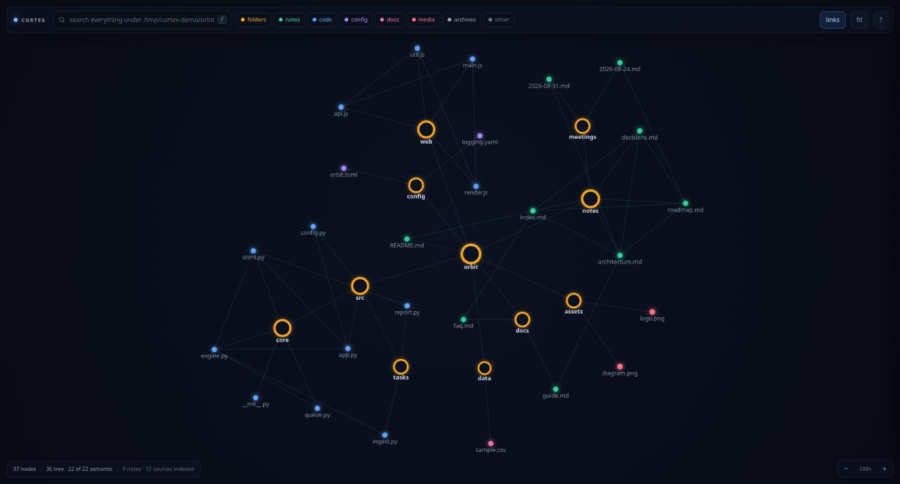
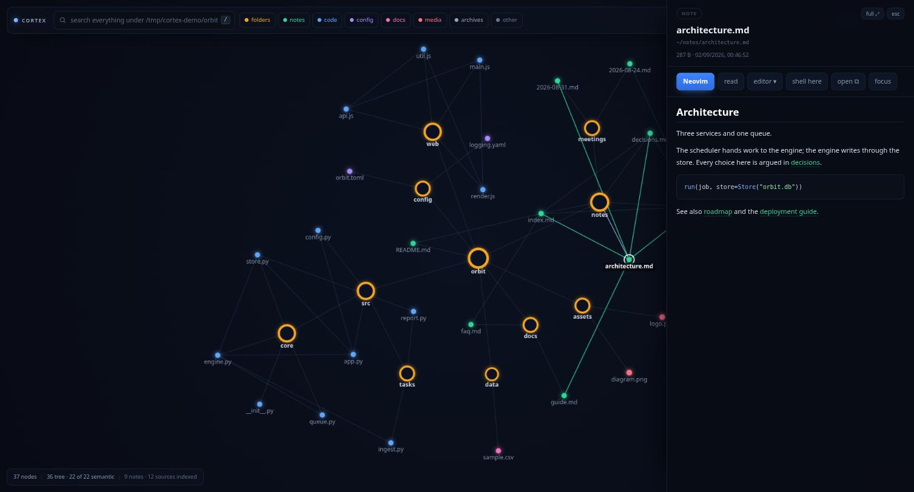
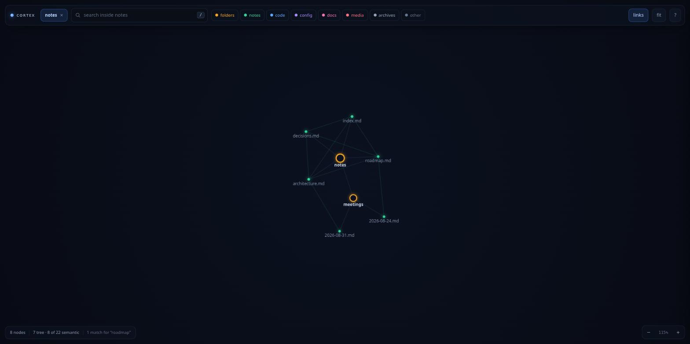

# cortex

**See your files as a graph. Read them. Open them in your editor — in the
terminal you started from.**

Point `cortex` at a folder and it draws everything inside as a living map:
folders, notes, code, PDFs, and the links between them. Click a node to read
the file. Press <kbd>Enter</kbd> and it opens in Neovim, in your terminal, right
where you were.



No dependencies. No database. No import step. It reads your disk directly, and
it is about 3,600 lines of Python standard library and vanilla JavaScript.

---

## Contents

- [What problem it solves](#what-problem-it-solves)
- [Install](#install)
- [First run](#first-run)
- [Reading files](#reading-files)
- [Following the links](#following-the-links)
- [Searching](#searching)
- [Opening files in your editor](#opening-files-in-your-editor)
- [Working on one project](#working-on-one-project)
- [Reading the graph](#reading-the-graph)
- [Every command and key](#every-command-and-key)
- [How it works](#how-it-works)
- [Tests](#tests)
- [FAQ](#faq)

---

## What problem it solves

Note apps like Obsidian, Logseq and Anytype draw a beautiful graph — of one
vault you set up for them, containing only markdown. Your actual work is not in
one vault. It is scattered across forty project folders, and half of it is code.

cortex maps what is really on your disk:

|                             | Obsidian / Logseq / Anytype | cortex |
| --------------------------- | --------------------------- | ------ |
| What it can see             | one vault you curate        | any folder, including your whole home directory |
| Understands code            | no                          | yes — Python, JS/TS, Go, Rust, C, shell |
| Links it draws              | `[[wikilinks]]`             | wikilinks **and** resolved code imports |
| Opens a file in Neovim      | no                          | yes, in your real terminal |
| Reads PDFs                  | via a plugin                | built in |
| Setup before first use      | create and index a vault    | none |
| Runtime                     | Electron                    | Python stdlib |

The part no note app can do: cortex is launched **from** a terminal and keeps
it. Clicking "Neovim" runs `nvim` on your TTY. You edit, you quit, and you are
back at the graph — still open, still where you left it.

---

## Install

You need Python 3.9 or newer and a browser. That is all. Linux and macOS are
both supported.

```bash
pipx install cortex-graph
```

Or from the source, which is the same thing without the packaging:

```bash
git clone https://github.com/Ayushsinha322/cortex.git ~/cortex
cd ~/cortex
./install.sh
```

`install.sh` writes a small `cortex` launcher into `~/.local/bin` pointing back
at this folder. If that folder is not on your `PATH`, add it:

```bash
export PATH="$HOME/.local/bin:$PATH"
```

Prefer not to install anything? Run it straight from the clone:

```bash
python3 ~/cortex/cortex.py
```

---

## First run

```bash
cortex
```

A window opens showing your home directory. On Chrome, Brave or Edge it is a
real app window — no tabs, no address bar. Firefox gets a normal window.

Your terminal stays where it is and prints what it is doing:

```
   ___ ___  ___ _____ _____  __
  / __/ _ \| _ \_   _| ____|\ \/ /   your filesystem as a brain
 | (_| (_) |   / | | | _|    >  <    v0.1.0
  \___\___/|_|_\ |_| |___|  /_/\_\

  mapping   ~
  editors   Neovim, nano, vi, VSCodium
  url       http://127.0.0.1:41277/?t=...
  window    opened with google-chrome

  ready. click a node in the window; actions land here. ctrl-c to quit.
```

Leave that terminal alone — it is where your editor will appear.
<kbd>Ctrl-C</kbd> when you are done.

**Getting around the graph:**

- **Click** a node to select it and open the reader
- **Double-click** a folder to grow it into the graph (again to collapse)
- **Drag** a node to move it; drag empty space to pan
- **Scroll** to zoom toward your cursor
- Press <kbd>/</kbd> to search everything, however deep
- Press <kbd>0</kbd> to fit the whole graph on screen

Nothing is loaded until you ask for it. A home directory can be hundreds of
gigabytes; cortex reads one folder per double-click, so it does not care how
big yours is.

---

## Reading files

Select a file and it is rendered in the panel on the right.



| File type | What you get |
| --------- | ------------ |
| Markdown  | fully rendered — tables, task lists, code blocks, `[[wikilinks]]` |
| Code      | syntax highlighted, with line numbers |
| PDF       | your browser's own PDF viewer, inline |
| Images    | shown; **video and audio** play |
| CSV / TSV | a scrollable table |
| Notebooks | `.ipynb` flattened into readable markdown |
| Word      | `.docx` text extracted, with no dependencies |

**Clicking a `[[wikilink]]` grows the graph to that note and selects it.** Same
for a relative markdown link. This is how you follow a train of thought without
ever touching a file manager.

### Full screen

The panel is 520px, which is fine for a note and useless for a 500-page PDF.
Press <kbd>m</kbd>, or the **full ⤢** button, and the reader takes the whole
window — the document gets about 91% of it. <kbd>esc</kbd> brings the graph
back; a second <kbd>esc</kbd> closes the reader.

The file is not re-rendered when you switch, so a PDF keeps its page and scroll
position, and at full width your browser's viewer regains its page thumbnails,
outline and zoom controls.

---

## Following the links

Under the actions in the reader is a list of every file connected to this one:
what it links to, and what links back to it.

```
  4 connections                         3 out · 1 in
    →  lexer.rs        src/parser/
    →  util.rs         src/
    →  ast.rs          src/parser/
    ←  main.rs         src/
```

The arrow says which way the link runs. Green names are note links, blue ones
are code imports, the same colours the graph draws them in.

**The list is not limited to what is on screen.** The index knows every link
under the root, so a file can be listed here long before its folder has been
grown into the graph. Click it and cortex opens the folders it needs to and
selects it. That is the fastest way through a codebase you do not know: open
one file, read what calls it, jump, repeat.

Press <kbd>c</kbd> to collapse the list when you want the height back. It is
hidden in full screen, where you are there to read the file.

---

## Searching

Press <kbd>/</kbd> and the box searches **file names**, anywhere under the root,
however deep. Matches are grafted into the graph with their real folder lineage,
so you see where a file lives rather than a flat list.

Press <kbd>tab</kbd>, or click the small **names** button in the box, and it
searches **inside** files instead:

```
  plan.md:2       the budget is fixed
  old.md:7        an old budget note
  costs.py:41     BUDGET = 10
```

That is the question you usually have about your own notes — not "where did I
put it" but "where did I say that". Click a result and cortex opens the folders
it needs to, selects the file, and remembers the line.

**The line then follows you into your editor.** With a hit selected,
<kbd>Enter</kbd> opens the file at that line rather than at the top —
`nvim +41`, `hx file:41`, `code -g file:41`, whichever you use. <kbd>r</kbd>
pages to it too. An editor cortex does not have a rule for is opened at the top
of the file, because guessing a flag would stop it opening at all.

Content search uses `rg` when you have it installed, and falls back to a plain
walk when you do not, so it is faster if you have ripgrep and still works if you
do not. Either way it reads only text files, and never anything `.gitignore`
excludes.

---

## Opening files in your editor

This is the point of the whole thing.

With a file selected, press <kbd>Enter</kbd> or click the blue editor button.
Your terminal — the one you ran `cortex` in — becomes your editor:

```
┌─ nvim ~/myproject/DEPLOY.md  (quit to return to the graph)
...
└─ back at the graph
```

Quit the editor and the graph is still there, still live, still on the same
node.

Other actions on every file:

| Button | What happens |
| ------ | ------------ |
| **Neovim** (or your first editor) | opens it in your terminal |
| **read** | pages through it with `bat` or `less` |
| **editor ▾** | any other editor you have installed |
| **shell here** | drops you into `$SHELL` in that folder; exit to return |
| **open ⧉** | hands the file to your desktop's default app |
| **focus** | hides every node not linked to this one |

**If you have set `$EDITOR` or `$VISUAL`, that is what <kbd>Enter</kbd> uses.**
You have already told your system which editor you want; cortex is not going to
argue. `$VISUAL` wins over `$EDITOR`, and arguments are kept, so
`EDITOR="emacs -nw"` and `EDITOR="code --wait"` both work.

Failing that, editors are found on your `PATH` automatically. Terminal
editors — `nvim`, `vim`, `nano`, `micro`, `helix`, `kakoune`, `emacs -nw` — run
in the foreground on your TTY. Window editors — `code`, `zed`, `subl`, `kate` —
are launched detached and marked `⧉`.

---

## Working on one project

Pointing cortex at a single project opens the **whole project at once** — three
folder levels deep, smallest folders first — instead of making you click through
rings of folders:

```bash
cortex ~/myproject
cortex .                # just this folder
```

Name it once and it is a keystroke away forever:

```bash
cortex ~/myproject --save myproject   # save under a name, and open it
cortex -P myproject                   # open it again later
cortex --list                         # what have I saved?
cortex --forget myproject             # remove one
```

Saved as plain JSON in `~/.config/cortex/projects.json`, so you can edit it by
hand.

How much opens on launch:

```bash
cortex -P myproject -d 5           # five levels deep
cortex -P myproject -d 0           # nothing; click in yourself
cortex ~/big-repo --max-nodes 300  # stop after 300 nodes
```

Default is 3 levels for a folder you name, and **0 for your home directory** —
a home directory is far too big to open eagerly.

### What it leaves out

cortex skips caches, build output and dependency trees by name — `node_modules`,
`__pycache__`, `target`, `.venv` and the rest — because they are noise in a
graph of what you wrote.

That list cannot know your project writes to `generated/`, so **cortex also
reads the project's `.gitignore`**, the file where you already wrote that down.
Negation, directory-only patterns and nested `.gitignore` files all behave the
way git behaves, so a folder that is clean in `git status` is clean here.
Pass `--no-gitignore` when you want to see what git is hiding.

### The directory sidebar

You do not have to decide up front. Click **☰** in the top left, or press
<kbd>s</kbd>, and a sidebar lists every folder in the root. Click one and the
graph is rebuilt around just that folder — everything else is not dimmed or
filtered, it is gone:



Click another folder to jump straight to it. **Close the sidebar and the whole
map comes back**, exactly as it looked when you launched — closing is always the
way out, so it is not a mode you can get stuck in.

There is a filter box for when the root has a lot of folders, and the row you
are currently in is highlighted.

### Narrowing from the graph itself

Same idea without the sidebar: select any folder node and press <kbd>o</kbd>, or
click **only this**. A pill appears in the top bar with the folder's name — click
it, or press <kbd>b</kbd>, for the whole map again.

Search narrows along with the view, and says so when a match exists but is out of
sight (`0 matches for "roadmap" (1 outside this folder)`), so a narrowed graph
never quietly hides results. Following a `[[wikilink]]` that points outside the
folder widens back out on its own.

This is a view, not a permission: the folder you launched on is still the
security boundary, and narrowing never lets you reach outside it.

**Single projects are where the graph pays off.** Across a whole home directory
most links have one end off-screen, so the graph looks like a plain tree. Inside
one project nearly every link resolves at once. The screenshots above are a
26-file project: 37 nodes and **22 of 22** semantic links drawn.

---

## Reading the graph

**Colour** is the kind of file — folder, note, code, config, document, media,
archive — matching the chips along the top bar.

**Size** is how much is inside: child count for a folder, file size for a file.

**A ring instead of a dot** means an open folder. **A soft glow** means the file
changed in the last week.

**Edges** come in three kinds:

| Edge | Meaning |
| ---- | ------- |
| faint grey-blue | the filesystem — a folder to what is inside it |
| **green** | a note link: `[[wikilinks]]` and relative markdown links |
| **blue** | a code import, resolved to a real file on disk |

Code links are found by actually resolving the import:

| Language | Read from |
| -------- | --------- |
| Python   | `import a.b`, `from .x import y` |
| JS / TS  | `import … from './x'`, `require('./x')` |
| Go       | `import "yourmodule/pkg"`, resolved through `go.mod` |
| Rust     | `mod x;`, `use crate::a::b`, `use super::x` |
| C / C++  | `#include "x.h"` |
| Shell    | `source ./x.sh`, `. ./x.sh` |

Go and Rust are resolved the way their compilers see them, not by guessing at
filenames. A Go import names a package, so cortex reads `go.mod` for the module
path and links to every source file in the imported directory — third-party and
standard-library imports are left alone, because they are not on your disk under
this root. Rust is the opposite shape: `mod` declares a file and `use` walks a
path through those files, including `foo.rs` owning the `foo/` beside it.

The index is built in the background as soon as you launch, and links appear as
it goes. On a 133,000-file home directory it finishes in about three seconds.

Toggle semantic links with the **links** button or <kbd>l</kbd>, and hide whole
categories with the coloured chips in the top bar.

---

## Every command and key

```
cortex [folder] [options]

  folder                  what to map (default: your home directory)

  -P, --project NAME      open a saved project
      --save NAME         save this folder under NAME, then open it
      --list              list saved projects
      --forget NAME       delete a saved project

  -d, --depth N           folder levels to open on launch
      --max-nodes N       stop auto-opening after N nodes (default 700)

  -a, --hidden            include dotfiles and dot-folders
      --ignore a,b,c      extra folder names to skip
      --no-gitignore      show what git hides, too
      --no-links          skip the semantic index (instant start)

  -w, --window MODE       app (default) | tab | none
  -b, --browser BIN       force a particular browser
  -p, --port N            pin the port
  -V, --version
```

| Key | Does |
| --- | ---- |
| <kbd>/</kbd> | search everything under the root |
| <kbd>tab</kbd> | in the search box: file names, or inside files |
| <kbd>Enter</kbd> | open the selection in your editor, in the terminal |
| <kbd>r</kbd> | page through the selection in the terminal |
| <kbd>m</kbd> | full screen the reader |
| <kbd>e</kbd> | expand / collapse the selected folder |
| <kbd>f</kbd> | focus mode — hide everything not linked |
| <kbd>c</kbd> | collapse / expand the connections list |
| <kbd>s</kbd> | open / close the directory sidebar |
| <kbd>o</kbd> | only this folder — rebuild the graph around the selection |
| <kbd>b</kbd> | back to the whole map |
| <kbd>l</kbd> | show / hide semantic links |
| <kbd>0</kbd> | fit the graph on screen |
| <kbd>?</kbd> | the shortcut list |
| <kbd>esc</kbd> | leave full screen, then close the reader |

Optional extras, if you have them: `rg` for faster content search, `bat` for
nicer terminal reading, `pdftotext` to page a PDF in the terminal.

---

## How it works

```
you type `cortex`
        │
        ├─ a local HTTP server starts on 127.0.0.1, with a fresh random token
        ├─ a browser window opens pointing at it
        └─ your terminal waits, holding your TTY
                 │
        window ──┤ "open this file in nvim"
                 ▼
        the terminal runs nvim in the foreground, on your TTY
```

Four ideas worth knowing:

**Nothing is read until you ask.** One folder per expansion. Whether you point
it at a 20-file project or a 140GB home directory, launch takes the same time.

**The link index is separate from the graph.** It walks the whole folder once in
a background thread and the UI adds edges as both ends become visible. You never
wait for it.

**The layout settles and then stops.** Force-directed graphs that simulate
forever jitter, and jitter reads as flicker — labels sit right on the collision
threshold and blink. cortex cools the simulation to a freeze and then stops
drawing entirely, so an idle graph costs no CPU and no battery. Touching
anything wakes it.

**Security.** This API can start editors and shells, so: it binds to
`127.0.0.1` only, requires a random token regenerated every run, and resolves
every path with `realpath` to prove it is genuinely inside the folder you mapped
before touching it. Symlinks pointing out are refused.

The page is served under a strict `Content-Security-Policy`, because a markdown
file in a repository you cloned is untrusted input. The renderer escapes HTML;
the policy is the second lock, and it allows no script at all except the two
files cortex serves and one inline config blob carrying a nonce regenerated on
every request. All of that is asserted in the tests.

### Layout

```
cortex/
├── cortex.py             run it without installing
├── install.sh
├── pyproject.toml        so `pipx install` works; no dependencies to declare
├── cortex/
│   ├── cli.py            arguments, saved projects, window launch, action loop
│   ├── scanner.py        lazy folder scanning, ignore rules, node building
│   ├── ignore.py         .gitignore parsing, the way git reads it
│   ├── links.py          the semantic index: wikilinks and code imports
│   ├── grep.py           content search, through ripgrep or a plain walk
│   ├── reader.py         per-filetype preview extraction
│   ├── actions.py        editor detection, terminal handoff
│   ├── server.py         local HTTP API, token check, path guards
│   └── ui/
│       ├── index.html
│       ├── style.css
│       ├── app.js        canvas force layout and the reader panel
│       ├── markdown.js   markdown renderer, no dependencies
│       └── highlight.js  syntax highlighter, no dependencies
└── tests/
    ├── run                  runs everything
    ├── test_cortex.py       scanner, links, reader, actions, HTTP surface
    ├── harness.js           the stub DOM the browser-side tests run against
    ├── markdown.test.js     the markdown renderer
    ├── render-loop.test.js  cooling and repaint gating
    ├── connections.test.js  backlinks, and following one into the graph
    └── search.test.js       both searches, and the line reaching the editor
```

---

## Tests

```bash
tests/run                          # all of it
python3 tests/test_cortex.py       # python only
node tests/markdown.test.js
node tests/render-loop.test.js
node tests/connections.test.js
node tests/search.test.js
```

207 tests, no framework to install — `unittest` and plain `node`. They run on
every push against Python 3.9 and 3.13 on Linux, and 3.13 on macOS. `tests/run`
also byte-checks every source file, because raw NUL bytes once got into two UI
files and made git treat them as binary, silently breaking diffs and `grep`.

The browser-side suites drive the real `app.js` against a stub DOM
(`harness.js`) with a manual frame pump. That is not for speed: Chrome pauses
`requestAnimationFrame` in background tabs, so "has the layout stopped
repainting?" cannot be answered from an automated browser — it reports a frozen
canvas whether the code is right or not. Pumping frames by hand gives a real
answer.

---

## FAQ

**Does it change my files?**
No. cortex only ever reads. The only thing it writes is
`~/.config/cortex/projects.json` when you use `--save`. Your editor can of
course write, but that is your editor.

**Does anything leave my machine?**
No. The server binds to `127.0.0.1`, there are no external requests, and no CDN
— the CSS and JavaScript are served from the folder you cloned.

**Can other users on this machine see it?**
No. It listens on loopback only and every request needs a token that is
regenerated on each launch.

**Why a browser window and not a terminal UI?**
Because the graph needs to be pretty and PDFs need to be readable, and neither
survives being drawn in text. The browser is the renderer; the terminal is still
the place work happens.

**Which editor does <kbd>Enter</kbd> open?**
Whatever `$VISUAL` or `$EDITOR` says, if either is set and names something
installed. Otherwise the first terminal editor found on your `PATH`. The
**editor ▾** menu has the rest, and the reader's button always shows which one
<kbd>Enter</kbd> will use.

**Does it work on macOS?**
Yes. Terminal handoff, the graph and the reader all behave the same; `open ⧉`
uses `open` instead of `xdg-open`.

**Can I use it over SSH?**
Run `cortex -w none`, forward the port (`ssh -L 41277:127.0.0.1:41277`), and
open the printed URL locally. Editor actions run on the remote terminal, which
is usually what you want.

**It says no browser found.**
Use `-w none` and open the URL yourself, or point it at a binary with
`-b firefox`.

**The graph is a plain tree with no green or blue links.**
You are probably looking at your whole home directory, where most links have one
end off-screen. Open a single project (`cortex ~/myproject`) and they appear —
or select that project's folder in the graph and press <kbd>o</kbd>.

**I opened my home directory but only want one project now.**
Press <kbd>s</kbd> for the sidebar and click the project, or select its folder in
the graph and press <kbd>o</kbd>. No need to quit and relaunch. Closing the
sidebar — or <kbd>b</kbd> — brings the full map back.

**Can I map a folder outside my home directory?**
Yes — any folder you can read. That folder becomes the boundary, and nothing
outside it can be opened.

---

## Licence

MIT. Do what you like with it.
